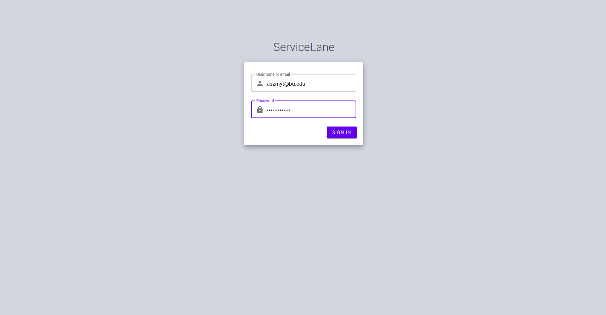

# ServiceLane

<a name="readme-top"></a>

<!-- PROJECT SHIELDS -->
<div id="shields" align="center"></div>

<!-- PROJECT LOGO -->
<br />
<div align="center">
  <a href="https://github.com/khipster-jhipster-org/CS633_Spring_2023_Project_Team_Four">
    
  </a>

<h3 align="center">Automotive Reservations</h3>

  <p align="center">
    <br />
    <a href="https://github.com/khipster-jhipster-org/CS633_Spring_2023_Project_Team_Four"><strong>Explore the docs »</strong></a>
    <br />
    <br />
    <a href="https://github.com/khipster-jhipster-org/CS633_Spring_2023_Project_Team_Four">View Demo</a>
    ·
    <a href="https://github.com/khipster-jhipster-org/CS633_Spring_2023_Project_Team_Four/issues">Report Bug</a>
    ·
    <a href="https://github.com/khipster-jhipster-org/CS633_Spring_2023_Project_Team_Four/issues">Request Feature</a>
  </p>
</div>

<!-- TABLE OF CONTENTS -->
<details>
  <summary>Table of Contents</summary>
  <ol>
    <li>
      <a href="#about-the-project">About The Project</a>
      <ul>
        <li><a href="#built-with">Built With</a></li>
      </ul>
    </li>
    <li>
      <a href="#getting-started">Getting Started</a>
      <ul>
        <li><a href="#prerequisites">Prerequisites</a></li>
        <li><a href="#installation">Installation</a></li>
      </ul>
    </li>
    <li><a href="#usage">Usage</a></li>
    <li><a href="#contact">Contact</a></li>
    <li><a href="#acknowledgments">Acknowledgments</a></li>
  </ol>
</details>


<!-- ABOUT THE PROJECT -->

## About The Project

The purpose of this project was to create an automotive reservation app that will allow customers to make reservations to get their vehicles serviced at their preferred dealership.


<p align="right">(<a href="#readme-top">back to top</a>)</p>

### Code Repository

* [![Github][Github]][Github-url]
    * GitHub, Inc. is an Internet hosting service for software development and version control using Git.

### Code Version Control

* [![Git][Git]][Git-url]
    * Git is a distributed version control system that tracks changes in any set of computer files, usually used for
      coordinating work among programmers collaboratively developing source code during software development.

### Communication

* [![Slack][Slack]][Slack-url]
    * Primary source of instant communication.


* [![Google Meet][GoogleMeet]][GoogleMeet-url]
    * Weekly team meetings.


* [![Gmail][Gmail]][Gmail-url]
    * Email communication.


* [![Google Drive][GoogleDrive]][GoogleDrive-url]
    * Primary repository for documentation.
    * https://drive.google.com/drive/folders/1o7f73oWn7xNPsvveYm5Iw-yOPXyP0rd7?usp=sharing 
    
### Project Management Tool

* Pivotal Tracker
    * Project management tool that allows teams to collaborate, prioritize tasks, and track progress in an Agile development environment.
    * https://www.pivotaltracker.com/n/projects/2626711
### Frontend

* [![React][React.js]][React-url]
    * UI Component Framework.


* [![Material UI][Mui]][Mui-url]
    * Material UI is a comprehensive library of components that features our implementation of Google's Material Design
      system.


* [![Keycloak][Keycloak]][Keycloak-url]
    * Authentication and User Identity Management.


* [![Redis][Redis]][Redis-url]
    * Cache server.


* [![webpack][Webpack]][Webpack-url]
    * webpack is a static module bundler for modern JavaScript applications.


* [![NodeJS][Nodejs]][Nodejs-url]
    * NodeJS is a Javascript runtime environment.


* [![Redux][Redux]][Redux-url]
    * Redux is an open-source JavaScript library for managing and centralizing application state.


* [![React Router][React-router]][React-router-url]
    * React Router enables "client side routing".


* [![React Hook Form][React-hook-form]][React-hook-form-url]
    * Performant, flexible and extensible forms with easy-to-use validation.


* [![Storybook][Storybook]][Storybook-url]
    * Frontend development tool for developing tools in isolation.

### Backend

* [![PostgreSQL][Postgresql]][Postgresql-url]
    * PostgreSQL, also known as Postgres, is a free and open-source relational database management system emphasizing
      extensibility and SQL compliance.


* [![Spring][Spring]][Spring-url]
    * The Spring Framework is an application framework and inversion of control container for the Java platform.

### Programming Languages

* [![Kotlin][Kotlin]][Kotlin-url]
    * Kotlin is a cross-platform, statically typed, general-purpose high-level programming language with type inference.


* [![Typescript][Typescript]][Typescript-url]
    * TypeScript is a strongly typed programming language that builds on JavaScript, giving you better tooling at any
      scale.


* [![Javascript][Javascript]][Javascript-url]
    * JavaScript, often abbreviated as JS, is a programming language that is one of the core technologies of the World
      Wide Web, alongside HTML and CSS.


* [![HTML5][HTML5]][HTML5-url]
    * HTML5 is a markup language used for structuring and presenting content on the World Wide Web.


* [![CSS][CSS]][CSS-url]
    * Cascading Style Sheets (CSS) is a stylesheet language used to describe the presentation of a document written in
      HTML or XML


* [![SASS][SASS]][SASS-url]
    * Sass is a preprocessor scripting language that is interpreted or compiled into Cascading Style Sheets.


* [![Markdown][Markdown]][Markdown-url]
    * Markdown is a lightweight markup language for creating formatted text using a plain-text editor.


* [![Shellscript][Shellscript]][Shellscript-url]
    * A shell script is a computer program designed to be run by a Unix shell, a command-line interpreter.

### Development Environment

* [![Npm][Npm]][Npm-url]
    * npm is a javascript software registry.


* [![Gradle][Gradle]][Gradle-url]
    * Gradle is a build tool with a focus on build automation and support for multi-language development.


* [![Intellij][Intellij]][Intellij-url]
    * IntelliJ IDEA is an integrated development environment written in Java for developing computer software written in
      Java, Kotlin, Groovy, and other JVM-based languages.


* [![Ubuntu][Ubuntu]][Ubuntu-url]
    * Ubuntu is a Linux distribution based on Debian and composed mostly of free and open-source software.


* [![GoogleChrome][GoogleChrome]][GoogleChrome-url]
    * Google Chrome is a cross-platform web browser developed by Google.

### Testing

* [![Jest][Jest]][Jest-url]
    * Jest is a JavaScript testing framework built on top of Jasmine and maintained by Meta.


* [![TestingLibrary][TestingLibrary]][TestingLibrary-url]
    * Simple and complete testing utilities that encourage good testing practices.


* [![Cucumber][Cucumber]][Cucumber-url]
    * Cucumber is a software tool that supports behavior-driven development.

### Deployment

* [![Docker][Docker]][Docker-url]
    * Docker is a set of platform as a service products that use OS-level virtualization to deliver software in packages
      called containers.


* [![Google Cloud Compute Engine][GoogleCloud]][GoogleCloud-url]
    * Compute Engine delivers configurable virtual machines running in Google's data centers with access to
      high-performance.

### Linting

* [![Eslint][Eslint]][Eslint-url]
    * ESLint statically analyzes your code to quickly find problems.


* [![Prettier][Prettier]][Prettier-url]
    * Code formatting for Javascript and Typescript.


* [![Sonarlint][Sonarlint]][Sonarlint-url]
    * SonarLint in the IDE helps you find & fix bugs and security issues from the moment you start writing code.

### Tools

* [![pgAdmin][pgAdmin]][pgAdmin-url]
    * pgAdmin is the most popular and feature rich Open Source administration and development platform for PostgreSQL.


* [![Portainer][Portainer]][Portainer-url]
    * Portainer Community Edition is a lightweight service delivery platform for containerized applications that can be
      used to manage Docker

<p align="right">(<a href="#readme-top">back to top</a>)</p>


<!-- GETTING STARTED -->

## Getting Started

Instructions for getting started placeholder.

### Prerequisites

This is an example of how to list things you need to use the software and how to install them.

* nvm [(Node Version Manager)](https://github.com/nvm-sh/nvm)

### Installation

1. Clone the repo
   ```sh
   git clone https://github.com/khipster-jhipster-org/CS633_Spring_2023_Project_Team_Four
   ```
2. Install [nvm](https://github.com/nvm-sh/nvm).
3. Use and install Node with nvm.
   ```sh
   cd app && nvm use
   ```
4. Install NPM packages
   ```sh
   npm install
   ```

<p align="right">(<a href="#readme-top">back to top</a>)</p>


<!-- USAGE EXAMPLES -->

## Usage

1. Start docker services.
   ```shell
   docker compose up --detach
   ```

2. Start backend API and frontend webapp.
   ```shell
   ./start.sh
   ```

<div id="login-screen" align="center">
  <a href="https://github.com/github_username/repo_name">
    
  </a>
</div>

<p align="right">(<a href="#readme-top">back to top</a>)</p>

<!-- CONTACT -->

## Contact

* David Hagedorn - dchage@bu.edu
* Samuel Apau - samapau@bu.edu
* Omima Hassan - ohassan9@bu.edu
* Alan Szmyt - aszmyt@bu.edu
* Minfei Liang - minfeil@bu.edu

**Project Link**: [https://github.com/samapau-bu/CS633_Spring_2023_Project_Team_Four][repo]

<p align="right">(<a href="#readme-top">back to top</a>)</p>


<!-- ACKNOWLEDGMENTS -->

## Acknowledgments

* [Keycloak Material Theme](https://github.com/MAXIMUS-DeltaWare/material-keycloak-theme)
* []()
* []()

<p align="right">(<a href="#readme-top">back to top</a>)</p>


<!-- MARKDOWN LINKS & IMAGES -->
<!-- https://www.markdownguide.org/basic-syntax/#reference-style-links -->

[repo]: https://github.com/samapau-bu/CS633_Spring_2023_Project_Team_Four

[product-screenshot]: images/screenshot.png

[login-screen]: resources/images/login-screen.png

[Postgresql]: resources/shields/postgres.svg

[Postgresql-url]: https://www.postgresql.org/

[React.js]: https://img.shields.io/badge/React-20232A?style=for-the-badge&logo=react&logoColor=61DAFB

[React-url]: https://reactjs.org/

[Redis]: resources/shields/redis.svg

[Redis-url]: https://redis.io/

[Spring]: resources/shields/spring.svg

[Spring-url]: https://spring.io/

[Kotlin]: resources/shields/kotlin.svg

[Kotlin-url]: https://kotlinlang.org/

[Typescript]: resources/shields/typescript.svg

[Typescript-url]: https://www.typescriptlang.org/

[Keycloak]: resources/shields/keycloak.svg

[Keycloak-url]: https://www.keycloak.org/

[Ubuntu]: resources/shields/ubuntu.svg

[Ubuntu-url]: https://ubuntu.com/

[Intellij]: resources/shields/intellij.svg

[Intellij-url]: https://www.jetbrains.com/idea/

[Gradle]: resources/shields/gradle.svg

[Gradle-url]: https://gradle.org/

[Npm]: resources/shields/npm.svg

[Npm-url]: https://www.npmjs.com/

[Docker]: resources/shields/docker.svg

[Docker-url]: https://www.docker.com/

[GoogleDrive]: resources/shields/googledrive.svg

[GoogleDrive-url]: https://drive.google.com/

[GoogleCloud]: resources/shields/googlecloud.svg

[GoogleCloud-url]: https://cloud.google.com/

[Storybook]: resources/shields/storybook.svg

[Storybook-url]: https://storybook.js.org/

[Webpack]: resources/shields/webpack.svg

[Webpack-url]: https://webpack.js.org/

[Gmail]: resources/shields/gmail.svg

[Gmail-url]: https://gmail.com

[GoogleMeet]: resources/shields/googlemeet.svg

[GoogleMeet-url]: https://meet.google.com/

[Slack]: resources/shields/slack.svg

[Slack-url]: https://slack.com/

[Git]: resources/shields/git.svg

[Git-url]: https://git-scm.com/

[Github]: resources/shields/github.svg

[Github-url]: https://github.com/

[Mui]: resources/shields/mui.svg

[Mui-url]: https://mui.com/

[Nodejs]: resources/shields/nodejs.svg

[Nodejs-url]: https://nodejs.org/en/

[Javascript]: resources/shields/javascript.svg

[Javascript-url]: https://mui.com/

[Sonarlint]: resources/shields/sonarlint.svg

[Sonarlint-url]: https://plugins.jetbrains.com/plugin/7973-sonarlint

[Jest]: resources/shields/jest.svg

[Jest-url]: https://jestjs.io/

[Redux]: resources/shields/redux.svg

[Redux-url]: https://redux.js.org/

[React-router]: resources/shields/react-router.svg

[React-router-url]: https://reactrouter.com/

[Prettier]: resources/shields/prettier.svg

[Prettier-url]: https://prettier.io/

[Eslint]: resources/shields/eslint.svg

[Eslint-url]: https://eslint.org/

[GoogleChrome]: resources/shields/googlechrome.svg

[GoogleChrome-url]: https://www.google.com/chrome/

[HTML5]: resources/shields/html5.svg

[HTML5-url]: https://developer.mozilla.org/en-US/docs/Glossary/HTML5

[CSS]: resources/shields/css3.svg

[CSS-url]: https://developer.mozilla.org/en-US/docs/Web/CSS

[SASS]: resources/shields/sass.svg

[SASS-url]: https://sass-lang.com/

[Markdown]: resources/shields/markdown.svg

[Markdown-url]: https://daringfireball.net/projects/markdown/

[React-hook-form]: resources/shields/react-hook-form.svg

[React-hook-form-url]: https://react-hook-form.com/

[TestingLibrary]: resources/shields/testinglibrary.svg

[TestingLibrary-url]: https://testing-library.com/

[Shellscript]: resources/shields/shellscript.svg

[Shellscript-url]: https://www.shellscript.sh/

[Cucumber]: resources/shields/cucumber.svg

[Cucumber-url]: https://cucumber.io/

[pgAdmin]: resources/shields/pgadmin.svg

[pgAdmin-url]: https://www.pgadmin.org/

[Portainer]: resources/shields/portainer.svg

[Portainer-url]: https://www.portainer.io/
